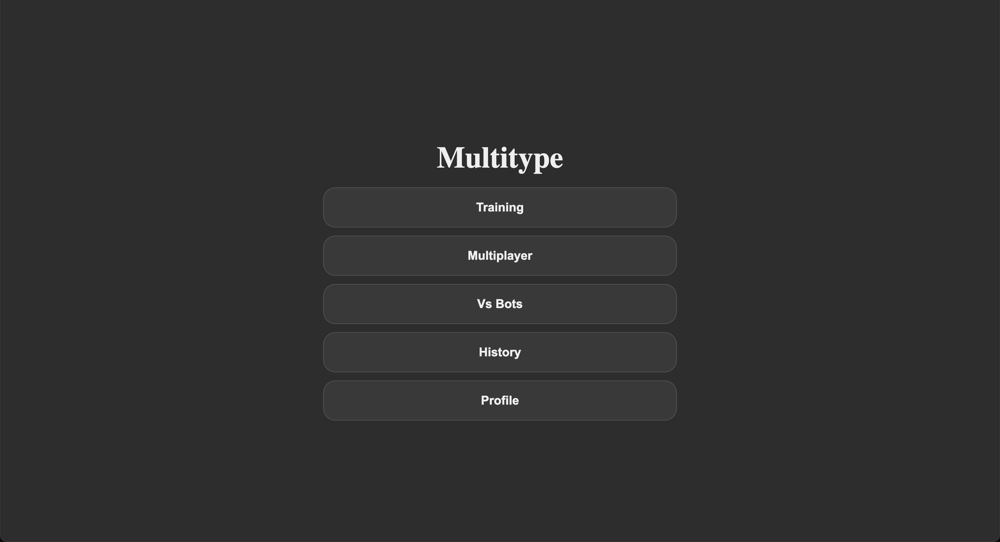

# multitype

Real-time multiplayer typing game. Up to 5 players race each other on the same prompt, server picks the seed, everyone syncs over WebSockets.

**Play it:** [multitype.pages.dev](https://multitype.pages.dev/)



## Stack

- React + TypeScript + Vite (frontend)
- Go + gorilla/websocket (server)
- Postgres via pgx (auth + race history, not required)

## Run locally

```bash
# backend
cd apps/server && go run .

# frontend, in another terminal
cd apps/web && npm install && npm run dev
```

Open http://localhost:5173. Postgres is optional, if you don't have it, only auth and history break, the game still works.

## How to play

**Training (solo).** Pick a length and start typing — the timer starts on your first keystroke. You have to fix mistakes before you can continue. `Esc` restarts the same prompt, `Enter` loads a new one when you're done. `Tab` is disabled so you can't tab out of the input by accident.

**Multiplayer.** Create a room to get a code, or join with someone else's code. Up to 5 racers per room. The host picks length and starts the race; everyone gets a 5-second countdown synced by the server. One opponent shows as split-screen, two or more show as ghost cursors on your own text so you can see who's ahead. Disconnect mid-race and you can rejoin from the same browser without losing your spot.

## Deploy

The server has a `Dockerfile` and reads `PORT`, `JWT_SECRET`, `DATABASE_URL` from env. The frontend reads `VITE_API_BASE` and `VITE_WS_URL` at build time. Drop the server on Render / Koyeb / Fly, the frontend on Cloudflare Pages / Vercel, point them at a Postgres (Supabase).
